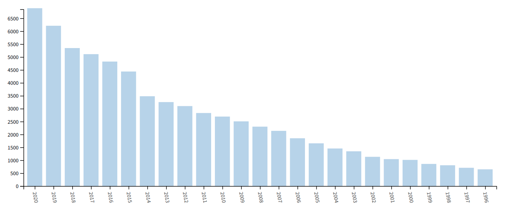
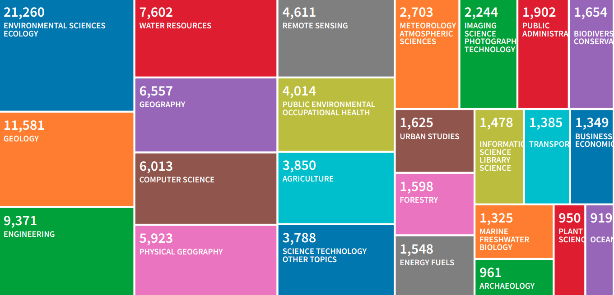
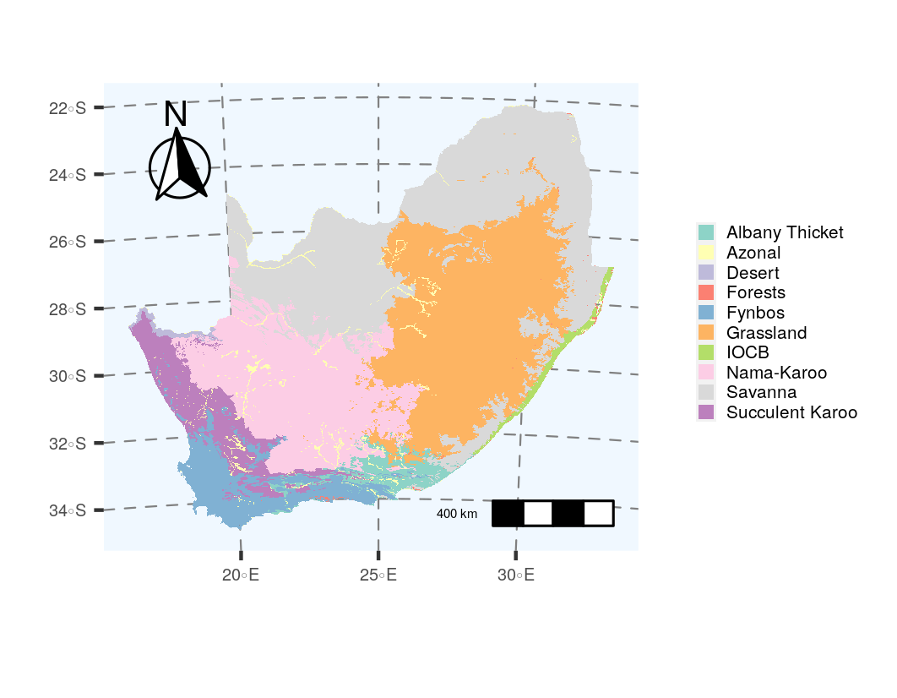

# Why care about GIS? {#intro}

How lost would you be without Google Maps?

```{r googlemap, echo=FALSE, fig.cap = "Screenshot of Google Maps for Cape Town.", fig.width=4, fig.align = 'center'}
knitr::include_graphics("img/googlemaps.jpg")
```

<br>

If we search "Geographic Information Systems OR GIS" in Web of Science, it is clear that the number of papers using GIS has exploded over time!

```{r gisbyyear, echo=FALSE, fig.cap = "The number of papers on Web of Science when searching `Geographic Information Systems` OR `GIS`.", fig.width=3, fig.align = 'center'}

```

<br>

GIS is especially important in environment and life sciences!

```{r gisbyfield, echo=FALSE, fig.cap = "The number of papers on Web of Science by theme when searching `Geographic Information Systems` OR `GIS`.", fig.width=3, fig.align = 'center'}

```

<br>

We use it for things like mapping ecosystems and biomes.

```{r biomes, echo=FALSE, fig.cap = "The historical extent of the biomes of South Africa.", fig.width=3, fig.align = 'center'}

```

<br>

Or the loss of ecosystems and biomes.

```{r biomeremnants, echo=FALSE, fig.cap = "The remaining extent of the biomes of South Africa.", fig.width=3, fig.align = 'center'}
knitr::include_graphics("img/biome_remnants.png")
```

<br>

Although the outcomes of GIS analyses are not always maps, e.g. this table from Skowno et al. -@Skowno2021.

```{r biomeloss, echo=FALSE, fig.cap = "", fig.width=3, fig.align = 'center'}
knitr::include_graphics("img/skowno2021.png")
```

<br>

But it can also be interactive!

```{r globalforestwatch, echo=FALSE, fig.cap = "The [Global Forest Watch](https://www.globalforestwatch.org/map/) app.", fig.width=3, fig.align = 'center'}
knitr::include_app("https://www.globalforestwatch.org/map/", 
  height = "600px")
```

<br>

You can label chapter and section titles using `{#label}` after them, e.g., we can reference Chapter \@ref(intro). If you do not manually label them, there will be automatic labels anyway, e.g., Chapter \@ref(methods).

Figures and tables with captions will be placed in `figure` and `table` environments, respectively.

```{r nice-fig, fig.cap='Here is a nice figure!', out.width='80%', fig.asp=.75, fig.align='center'}
par(mar = c(4, 4, .1, .1))
plot(pressure, type = 'b', pch = 19)
```

Reference a figure by its code chunk label with the `fig:` prefix, e.g., see Figure \@ref(fig:nice-fig). Similarly, you can reference tables generated from `knitr::kable()`, e.g., see Table \@ref(tab:nice-tab).

```{r nice-tab, tidy=FALSE}
knitr::kable(
  head(iris, 20), caption = 'Here is a nice table!',
  booktabs = TRUE
)
```

You can write citations, too. For example, we are using the **bookdown** package [@R-bookdown] in this sample book, which was built on top of R Markdown and **knitr** [@xie2015].
