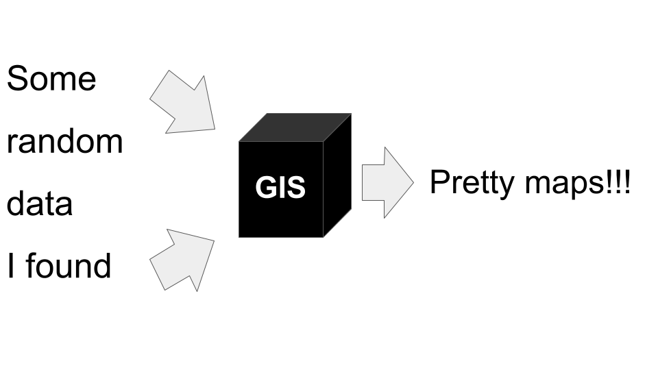
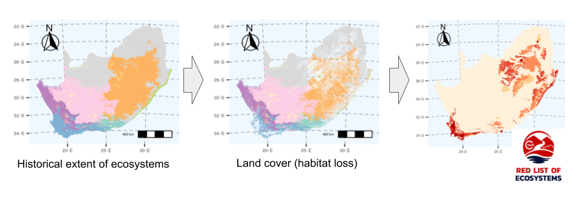
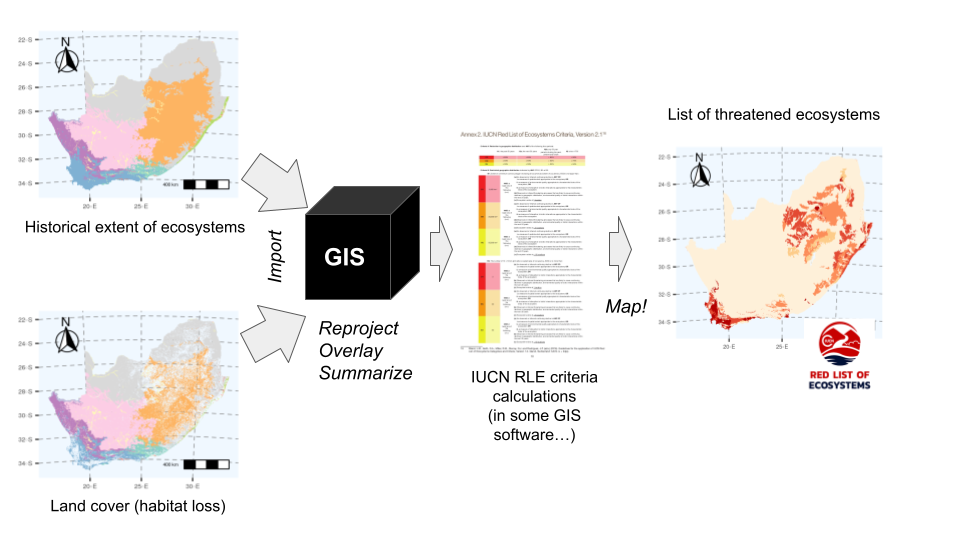
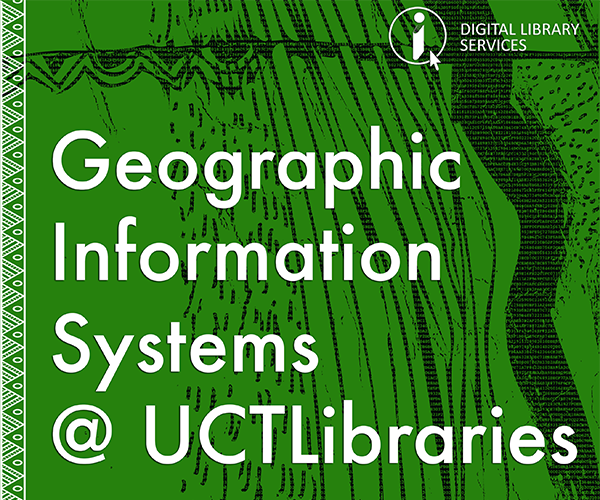

---
  bookdown::gitbook:
    config:
      toc:
        collapse: subsection
      edit: null
      download: null
---

# GIS basics

Here we cover the basics of GIS...

## What is GIS?

```{r whatisGIS, echo=FALSE, fig.cap = "", fig.width=3, fig.align = 'center'}

```

A Geographic Information System is a framework used to create, manage, visualize and analyze data in a spatial context. 

Most datasets can be assigned a spatial location, either on the earth's surface or within some constrained area like a sports field, a vegetation survey plot, or even a drawer in your kitchen.

While almost any dataset has a spatial context, and can thus be represented in a GIS, **the real question is whether it needs to be analyzed in a GIS environment?** The answer to this question depends on the **purpose** of the analysis. Typically, one would use GIS if you were using the spatial information associated with the data to:

* **_access_** data elements (e.g. select data by spatial location or coverage), 
* perform **_analytical operations_** (e.g. overlay and merge two datasets to produce a new dataset), or 
* **_render visualizations_** (e.g. generate a map).

<br>

### An example workflow
Identifying the list of South Africa's threatened ecosystems is largely based on analyses done in GIS, using the map of the historical extent of South Africa's vegetation types and the National Land Cover data (which, incidentally, were largely created using GIS...).

```{r rle1, echo=FALSE, fig.cap = "South Africa's list of threatened ecosystems depends heavily on GIS...", out.width='100%', fig.align = 'center'}

```

<br>

Here's a simplified breakdown of the steps in the GIS workflow...

<br>

```{r rle2, echo=FALSE, fig.cap = "A simplified workflow for assessing threat to South Africa's ecosystems, highlighting GIS operations (numbered and in italics).", out.width='100%', fig.align = 'center'}

```

<br>

There are **many many operations and functions** within each of the three major operation types _(access, analyze, map)_. There are also many support functions and operations that are common across the operation types. We'll delve into these later.

<br>

## How do we do GIS?

There are a large number of software packages for doing GIS. Some are free (often open source), while others require you to pay for a license (i.e. are proprietary). They also vary in what they do (or the combination of things they do). For example, some of the best known **_desktop GIS applications_**, which is what your average GIS user is interested in, include:

* [ArcGIS](https://www.esri.com/en-us/arcgis/about-arcgis/overview) - a proprietary product that works on Windows only (or online). UCT has a site license, which provides a set number of user licenses for UCT postgrads and staff (see section \@ref(ucthelp) for details). Note that ArcGIS is an ESRI product and comes with (or can be upgraded to include) a suite of other (commercial) software components in addition to the desktop application
* [QGIS](https://qgis.org/) ("Quantum GIS") - free and open source software (FOSS) for Windows, Mac or Linux
* [Google Earth](https://www.google.com/earth/versions/) - free (for now), but not open source, for Windows, Mac, Linux, or online

<br>

```{r qgis, echo=FALSE, fig.cap = "Screenshot of the [QGIS](https://qgis.org/) Desktop 3.14 graphical user interface (GUI).", out.width='100%', fig.align = 'center'}
knitr::include_graphics("img/QGIS.png")
```

<br>

Desktop GIS applications are typically [graphical user interfaces (GUIs)](https://en.wikipedia.org/wiki/Graphical_user_interface) that call on various other **_geospatial libraries_** to do the actual data processing (think of these as sets of functions or tools). Some examples of FOSS geospatial libraries are [GDAL](https://gdal.org/) and [GEOS](https://trac.osgeo.org/geos), which are designed to deal with different data models and/or file types. Another one you'll encounter quite a bit id [PROJ](https://proj.org/), which deals with coordinate reference systems.

We can also do GIS by calling the geospatial libraries and other GIS software types directly with various programming languages. While we can use many (or just about any) coding language, there are a few for which the functions and syntax are better developed for the user, including:

* R
* Python
* JavaScript

A major advantage of using these general purpose programming languages for your GIS work is that it allows you take advantage of their functions for statistical analyses and presentation etc all in one environment and/or work flow. This also makes it much easier to make your [research reproducible](https://www.ecologi.st/data-management/reproducibility.html).

Note that the geospatial libraries and the other GIS softwares that we call are coded in a variety of other languages, such as Java, C/C++, C# or SQL, but these languages are typically less user friendly and/or more difficult to learn.

Other "GIS software types" include:

* _spatial databases_ such as [PostGIS](https://postgis.net/), which is free and open source software (FOSS) for Windows, Mac or Linux and great for storing and querying large and complex datasets
* _web mapping_ such as [MapServer](https://mapserver.org/) or [GeoServer](http://geoserver.org/)
* I'm sure there are others I haven't thought of...

## How to get help? {#ucthelp}

```{r gislab, echo=FALSE, fig.cap = NULL, out.width= "40%", out.extra='style="float:right; padding:10px"'}

```

UCT has a [GIS Support Unit](https://lib.uct.ac.za/services-tools/gis-support) to assist UCT staff and postgraduate researchers with their GIS and spatial data needs. Their primary goal is to help users develop their GIS skills in order to perform sound data capture, geospatial analysis and map production. They can help you with:

* Troubleshooting, Project Planning, Analysis, Cartographic Design and Data Handling.
* GIS Training
* Applying for an ESRI (ArcMAP) Software license. 

Note that they predominantly work with ESRI and QGIS and don't provide support for R, etc. That said, many GIS work flow issues are common across platforms, and the support unit really know what they're doing. They're also a good source of data if you're struggling to find what you need, but please do your homework before asking them for data!

<br>

Lastly...

**I am not a help desk!!!**

The goal for this module is to teach you how to help yourself. I'm available to help in the afternoon office hours during this module, but unfortunately, while I would love to, I do not have the time to help you all with your GIS or R issues for the rest of your careers... 

You can find the answer to any issue you are encountering in an online forum like [GIS Stack Exchange](https://gis.stackexchange.com/). I typically just type my questions (or copy and past error messages) directly into Google. The trick is working out what to ask, and sometimes you need to reword your question a couple of times to find the answer you need. If you're really getting nowhere, you can even post your question on a forum, although it is unlikely that you'll ever need to do this...


