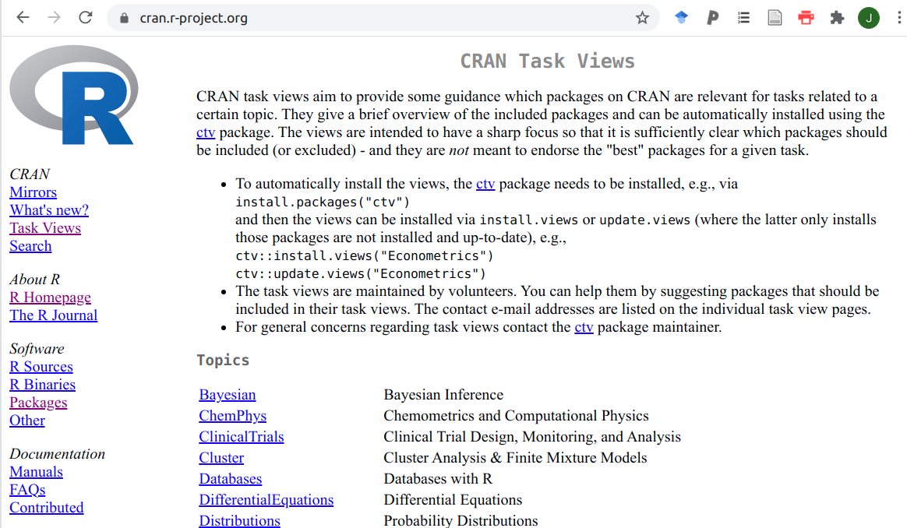
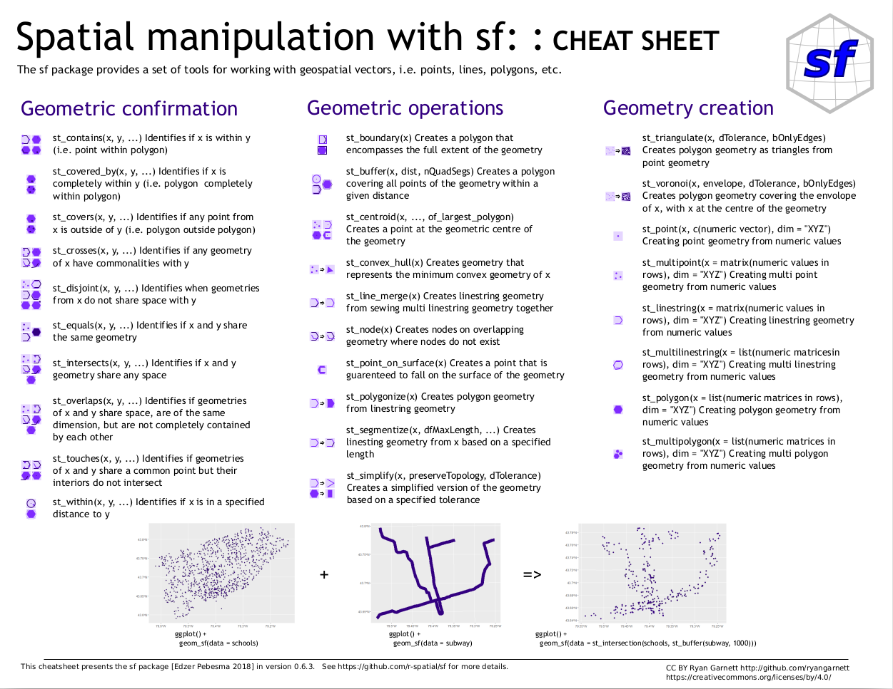
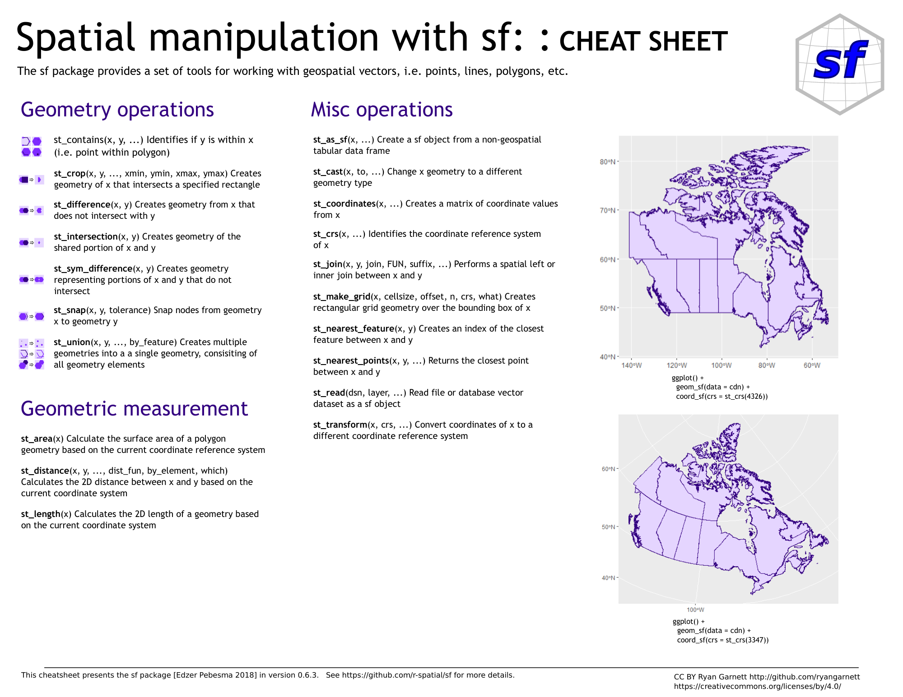

---
  bookdown::gitbook:
    config:
      toc:
        collapse: null
      edit: null
      download: null
---

# R as a GIS

## Overview

Points, lines, polygons and rasters - R can handle them all and more! [R](https://www.r-project.org/) is a free software environment for statistical computing and graphics, but its abilities have been extended into many realms through the ~18,000 (!) contributed [extension packages](https://cran.r-project.org/web/packages/available_packages_by_name.html) (also called libraries).

The list of packages can be bewildering, but fortunately some great folks have taken the time to sift through and make some sense of them for different focal topics and created _Task Views_.

<br>

**For GIS there are two Task Views of interest:**

* [Spatial](https://cran.r-project.org/web/views/Spatial.html) - maintained by Roger Bivand and Jakub Nowosad, and
* [SpatioTemporal](https://cran.r-project.org/web/views/SpatioTemporal.html) - maintained by Edzer Pebesma and Roger Bivand

They overlap somewhat, but the latter specifically focuses on data where both location and time of observation are registered, and relevant for the analysis of the data.

Each has an overview page listing packages and highlighting their respective strengths, weaknesses etc., e.g.

<br>

```{r spatialTV, echo=FALSE, fig.cap = 'Screenshot of the "Spatial" Task View at [https://cran.r-project.org/](https://cran.r-project.org/)', fig.width=5, fig.align = 'center'}
knitr::include_graphics("img/spatialTV.png")
```

<br>

The Spatial Task View focuses on "Analysis of Spatial Data", with sections on:

* Classes for spatial data and metadata
* Reading and writing spatial data
* Handling spatial data
* Visualizing spatial data
* Analyzing spatial data

Task Views also allow easy download and installation of all packages in a Task View using library(ctv) (which you can install with 
`install.packages("ctv")`). In this case the code you'd need to install the Task View is `ctv::install.views("Spatial", coreOnly = TRUE)`. _**But beware! If you leave out the `coreOnly = TRUE` it can take a while to download and install!!!**_ It may take a while even then... You don't need the whole Task View for my tutorials, so don't bother downloading it if you're just working through these.

<br>

```{r taskviews, echo=FALSE, fig.cap = 'Screenshot of the Task View landing page at [https://cran.r-project.org/](https://cran.r-project.org/)', fig.width=5, fig.align = 'center'}

```

<br>

## Some key R packages

We don't have time to go through all packages or provide a full history, but here are some notes in brief.

### For vector data 
(although some of these packages can handle rasters too) 

> The two leading packages were [_sp_](https://cran.r-project.org/web/packages/sp/index.html) and [_rgdal_](https://cran.r-project.org/web/packages/rgdal/index.html). While these are still active and useful, they are being superseded by a newer package [_sf_](https://cran.r-project.org/web/packages/sf/index.html), which is a modern implementation and standardization of parts of _sp_. It is highly recommended that you use _sf_ over these older packages as they will not be maintained in the long term, largely because they rely on other packages that are no longer maintained because their creators have retired.

<br>

_**sf**_ stands for "Simple Features for R", in compliance with the [OGC Simple Feature standard](https://www.ogc.org/standards/sfa). It is highly efficient, and comes with the advantage that it uses [_Tidyverse_](https://www.tidyverse.org/) principles and coding styles, e.g. allowing use of the pipe operator (`%>%`) and the direct application of library(dplyr) data manipulation and library(ggplot2) visualization functions.

I will use _sf_ for the most part in the demonstration material. Unfortunately, not all operations are available in _sf_ yet and I may still have to use _sp_ at times, especially when performing operations using both vector and raster data. 

Here's a quick list of the functions available in _sf_:

```{r}
library(sf)
methods(class = 'sf')
```

<br>

This doesn't tell you how to use them though. To get help with a function in R just type "?" followed by the function name, e.g. `?st_read`, and it'll take you to the help page.

Of course, you don't want to have to read every help page to find the function you want! Fortunately, here's a "cheat sheet" that allows you to find the function you want relatively quickly (once you're familiar with the syntax etc):

<br>

```{r sfcheatsheet1, echo=FALSE, fig.cap = "An R [_cheat sheet_ for library(sf)](https://github.com/rstudio/cheatsheets/blob/master/sf.pdf) by Ryan Garnett (page 1).", fig.width=5, fig.align = 'center'}

```

<br>

```{r sfcheatsheet2, echo=FALSE, fig.cap = "An R [_cheat sheet_ for library(sf)](https://github.com/rstudio/cheatsheets/blob/master/sf.pdf) by Ryan Garnett (page 2).", fig.width=5, fig.align = 'center'}

```

<br>

### For raster data 
By far the best package **has been** [_raster_](https://cran.r-project.org/web/packages/raster/index.html), maintained by Robert Hijmans (of [WorldClim](https://www.worldclim.org/) fame), and can do just about anything with rasters and interfaces with _sp_ very nicely. Unfortunately, both _raster_ and _sp_ are being phased out as explained above. _raster_ is currently being superseded by a new package called [_terra_](), also being developed by Hijmans.

> _"terra is very similar to the raster package; but terra is simpler, better, and faster"_ - Roger Bivand

I first developed this module using _raster_, because _terra_ was still largely in development, so I have kept the demonstrations of _raster_ for those who depend on them for now, but highly recommend you start using _terra_, because I'll likely remove the _raster_ material next year. It's worth noting that _raster_ and _terra_ can handle vector data directly too, and that sometimes their integration with _sf_ is a little clunky, but it does seem to get better all the time. Unfortunately, there's no cheat sheet for _terra_ or _raster_, but there's a lot of documentation and tutorials [here](https://rspatial.org/).

_terra_ is also able to handle **spatiotemporal arrays** (raster and vector data cubes). Think of these as time-series of GIS data, like satellite archives, etc. Other powerful packages to watch in the spatiotemporal space are [_stars_](https://cran.r-project.org/web/packages/stars/index.html) and [_gdalcubes_](https://cran.r-project.org/web/packages/gdalcubes/index.html).

<br>
